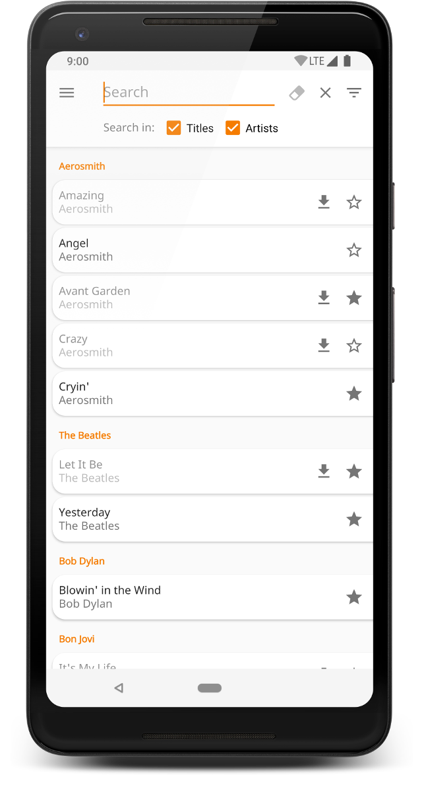
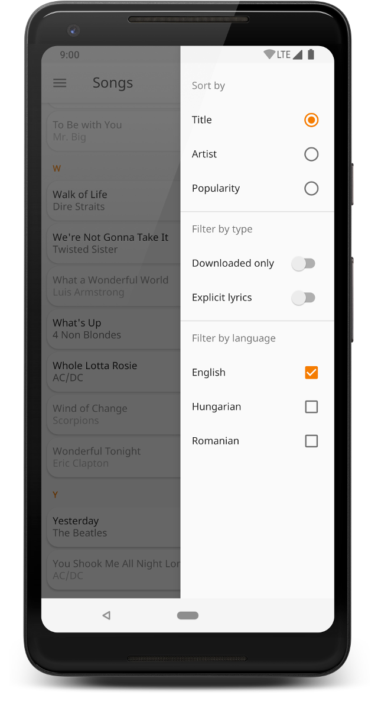
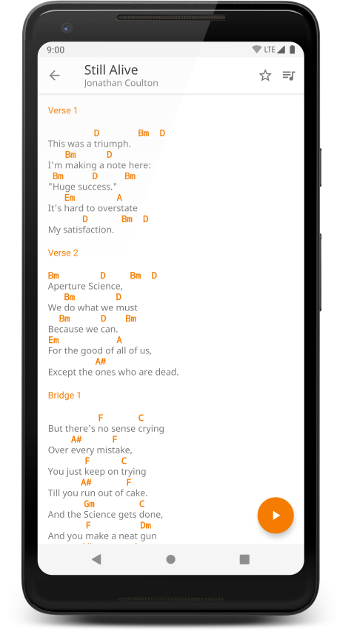
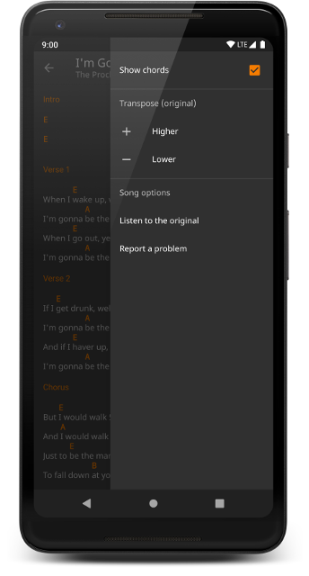
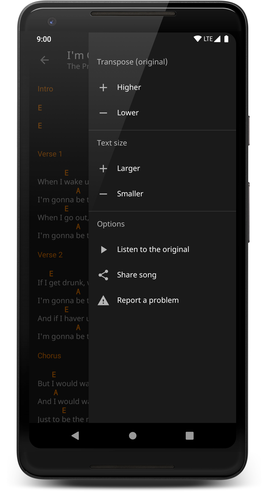
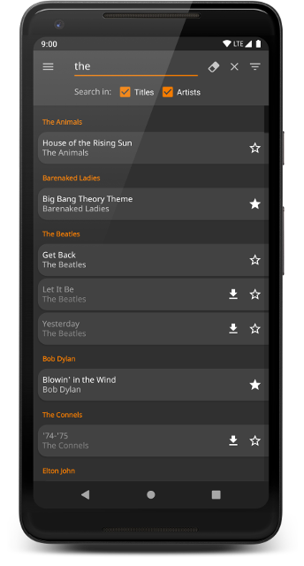
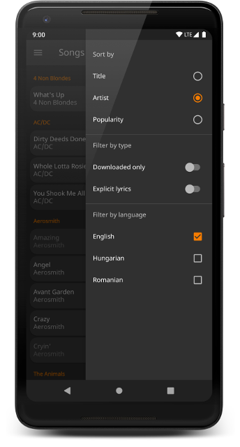
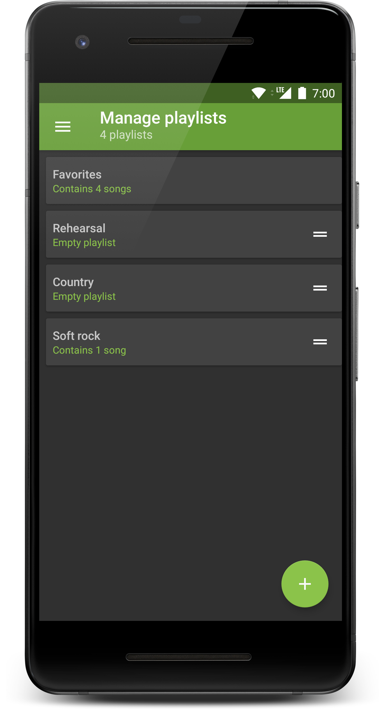

# Campfire (Android)
*Explore a handpicked library of high quality song lyrics and chords.*

Campfire is a companion app for musicians and people who like to sing. It contains a small, but growing number of songs and song collections as well as useful features such as transposing the key signature, auto-scroll or the ability to create your own playlists.

The app follows the latest Material design guidelines, featuring beautiful animations and supporting both light and dark themes. 

Campfire is completely free, without any ads.

* Download from [Google Play](https://play.google.com/store/apps/details?id=com.pandulapeter.campfire)
* Find the backend project [here](https://github.com/pandulapeter/campfire-backend)

### How to build
The **master** branch should always be buildable, you just need to create three configuration files after cloning the project (as these files contain sensitive information, they are not part of the repository).

*  Copy your **google-services.json** file to the **app** folder for the Firebase configuration. This does not need to be valid, as the **debug** build type will never use the Firebase API and I don't recommend compiling the other versions.
*  In the **app** folder, duplicate the **internal.keystore** file with the name **release.keystore**.
*  In the **app** folder, duplicate the **internal.keystore.properties** file with the name **release.keystore.properties**.

### Screenshots
 
 
 
 

### Pull requests
In general I'm not accepting pull requests for this project, it is only open-sourced only for educational purposes. If you find a bug or any possibility for improvements, I'd very much appreciate your feedback but I'd like to be the one fixing the issues. If you'd like to help me by adding more songs to the database, check out the backend project [here](https://github.com/pandulapeter/campfire-backend).

### Terms and Conditions
You are not allowed to publish a copy of the application, or any large part of it, or to make derivative versions. You are permitted to take inspiration from certain technical solutions, but pieces of software resulting from my work can only be used in non-competing products. The app itself and all the trademarks, copyright, database rights and other intellectual property rights related to it belong to me.

### License
Copyright (C) 2018 Pandula Péter

    Licensed under the Apache License, Version 2.0 (the "License");
    you may not use this file except in compliance with the License.
    You may obtain a copy of the License at

       http://www.apache.org/licenses/LICENSE-2.0

    Unless required by applicable law or agreed to in writing, software
    distributed under the License is distributed on an "AS IS" BASIS,
    WITHOUT WARRANTIES OR CONDITIONS OF ANY KIND, either express or implied.
    See the License for the specific language governing permissions and
    limitations under the License. 