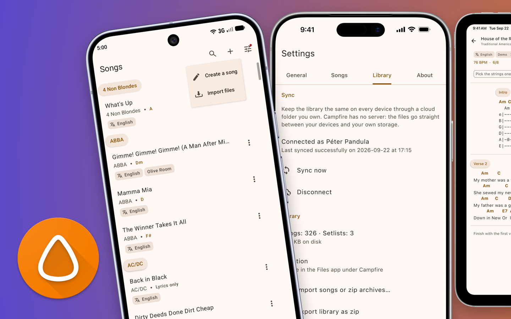
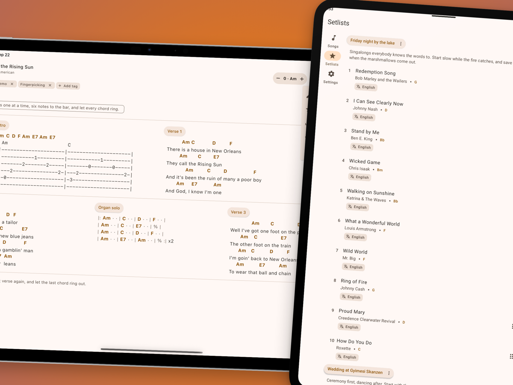
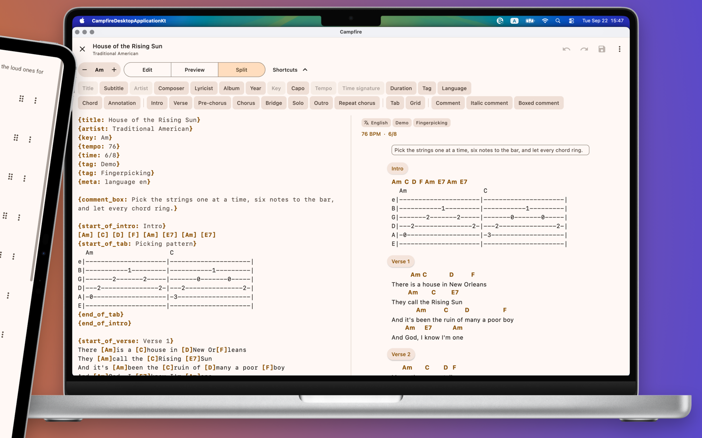
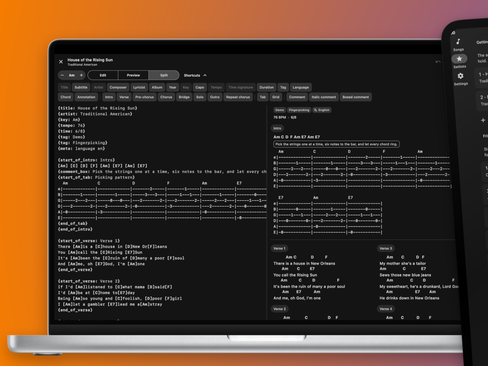
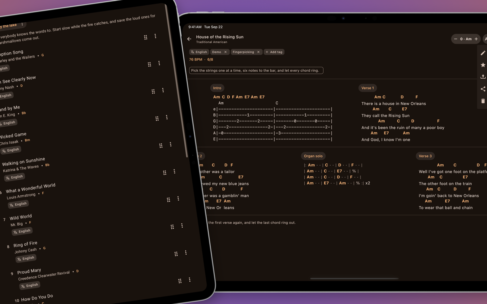
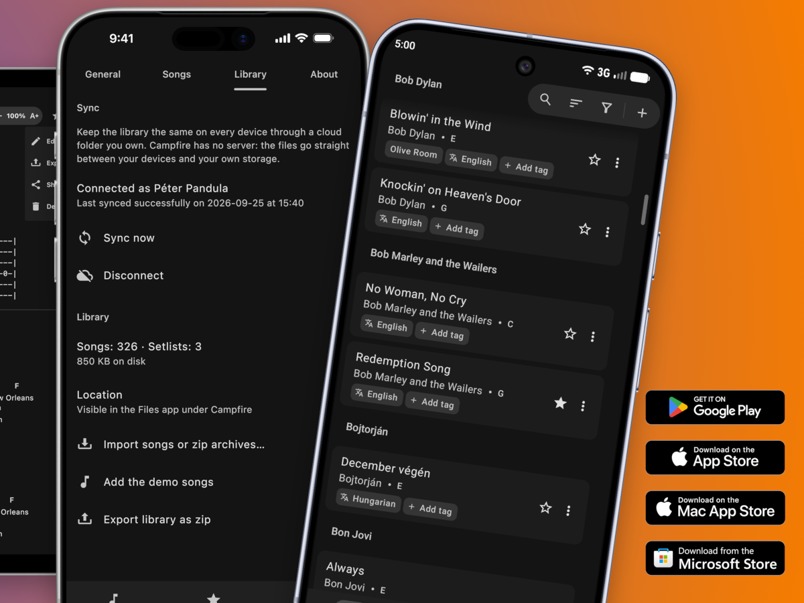
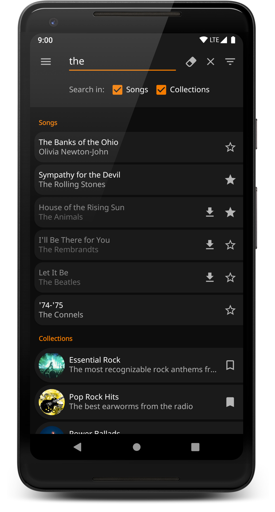
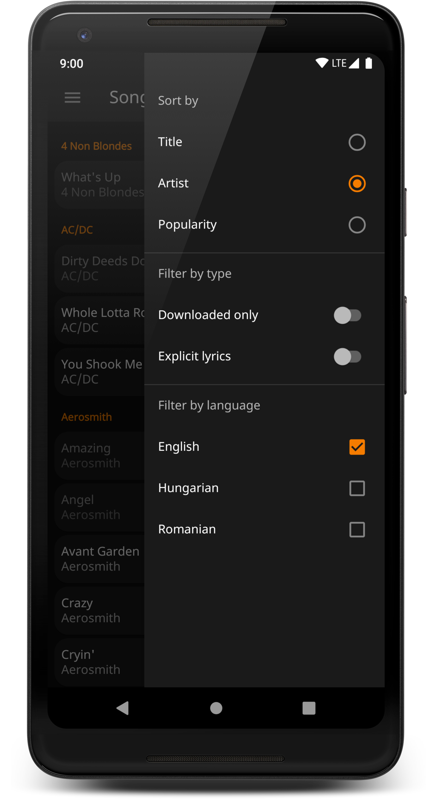

<!--
 * This file is part of Campfire.
 * Copyright (c) Pandula Péter 2017-2026.
 * https://github.com/pandulapeter/campfire
 *
 * This Source Code Form is subject to the terms of the Mozilla Public License, v. 2.0.
 * If a copy of the MPL was not distributed with this file, You can obtain one at
 * https://mozilla.org/MPL/2.0/.
-->
# Campfire
*Your songbook, on every screen you own.*

Campfire keeps your lyrics and chords in plain [ChordPro](https://www.chordpro.org) files and shows them the way you
want to read them while playing: chords above the syllables they belong to, as few and as wide columns as the screen
allows, and the text as large as you need it. Write songs in the built-in editor, transpose them into your key, put
them into setlists, and read them on your phone, your tablet, your laptop or in a browser.

It works **offline**, there is no account to make, and there is no server of mine anywhere. It is free, and there are
no ads.

The iOS and the macOS / Windows / Linux desktop builds are part of the same codebase and run from source, but they
are not deployed yet.

### Screenshots

 
 
 
 

*These are from Campfire 1.x, which had a built-in online song library. Version 4 is a rewrite and looks nothing like
them any more — new screenshots are on the way.*

### What it does

- **Read** with adjustable text size, a lyrics-only mode, and a performance mode that puts everything which could
  change your library out of the way while you are playing.
- **Transpose** by ear or by key, in sharps, flats or German notation.
- **Write and edit** in a ChordPro editor with syntax highlighting and a live preview.
- **Organize** into setlists, each song with its own transposition, and filter the library by tag or by language.
- **Import and export** single songs, setlists or the whole library as zip archives of plain text — and open a
  ChordPro file straight from a file manager, an email or a browser download.
- **Sync** between your devices through your own Dropbox, if you want to. Off until you turn it on.
- **Fits your setup**: light and dark in eight colour schemes, English and Hungarian, and arrow key control, which is
  what a page turner pedal sends.

More detail in [documentation/features.md](documentation/features.md).

### Your songs are yours

The library is a folder of ordinary text files in Campfire's own storage on your device. Nothing is uploaded, nothing
is analyzed, and the app collects nothing at all — what it does with your data is written out in the
[privacy policy](https://pandulapeter.com/legal/privacy_policy-campfire.html) linked from Settings.

The one thing that ever touches the network is sync, and only after you have connected a cloud folder **you** own,
which Campfire reaches directly with no service of mine in between. Everything can be exported at any time as a zip
any other ChordPro tool can read, so leaving is as easy as arriving.

### Documentation

- [Features](documentation/features.md) — everything the app does, at length.
- [File format](documentation/file-format.md) — the ChordPro directives Campfire understands, the setlist JSON, and
  how files are named.
- [Sync](documentation/sync.md) — what it sees, how a run decides, and why it needs no backend.
- [CLAUDE.md](CLAUDE.md) — the architecture, the module graph and the per-platform build commands.

### Notes

Version 4.0 is a rewrite: the online song library is gone and there is **no migration**. The first launch starts with
an empty library.

### To do
- Fix web Settings screen animation glitches caused by async data
- Improve the appearance and UI scalability of the Settings screen
- Add a database of copyright free starter songs
- Update the screenshots in the Readme
- Create new screenshots for iOS, Android and desktop
- Create iOS store listing
- Create GitHub action for TestFlight releases
- Create App Store and Windows Store Store listings + GitHub actions
- Add links to each build type referencing the other build types

### License

Copyright (c) Pandula Péter 2017-2026. This software is licensed under the
[Mozilla Public License 2.0](LICENSE).

The MPL is a file-level copyleft license, which means you are welcome to reuse any part of Campfire — the ChordPro
parser, the sync engine, a single screen — in your own project, open source or not. If you modify one of the files in
this repository, that file has to stay under the MPL and its source has to be available; anything new you write
alongside it is yours, under whatever license you choose.

The name *Campfire*, the app icon and the other branding assets are **not** covered by the license and remain the
author's. The MPL grants no trademark rights (section 2.3), so a fork has to ship under a name and an icon of its own.
