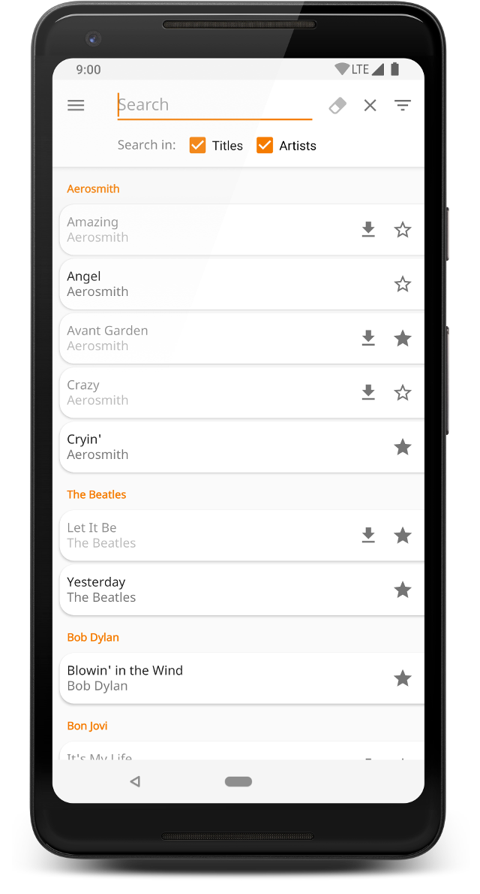
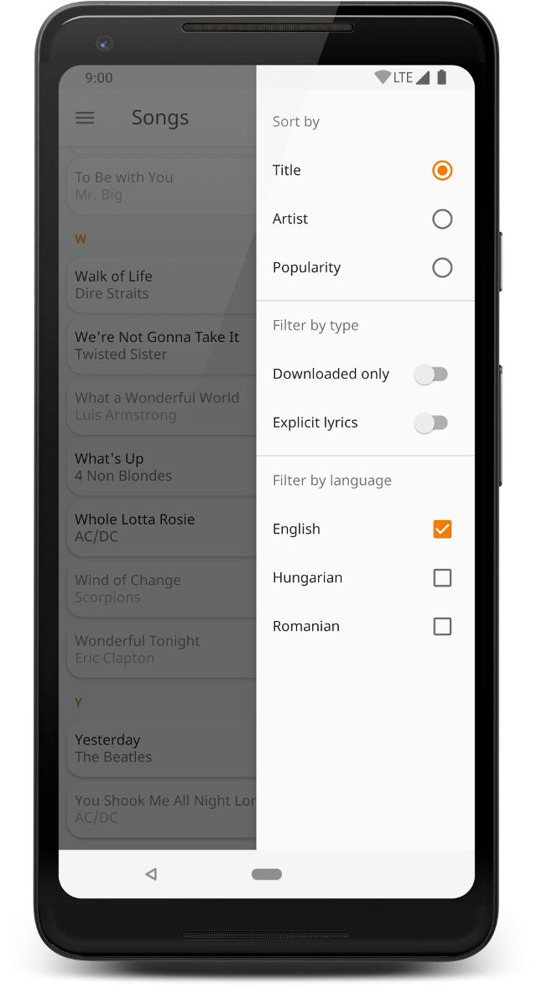
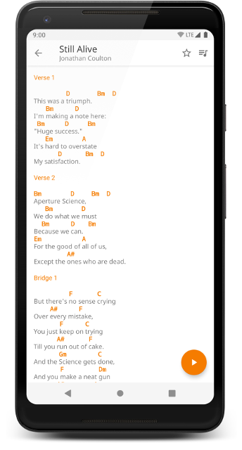
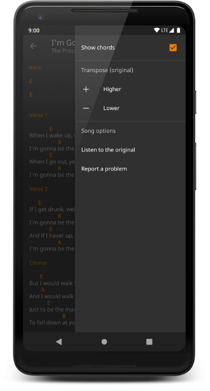
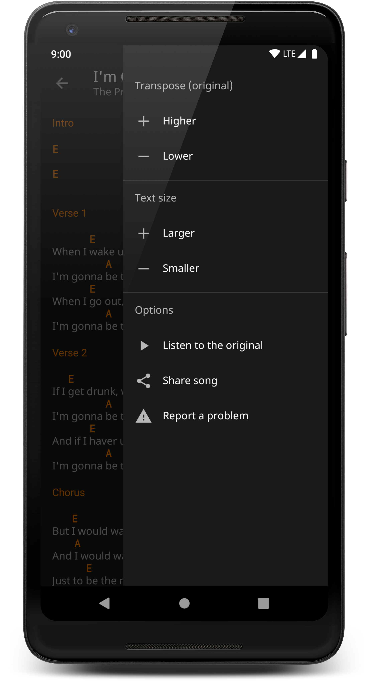
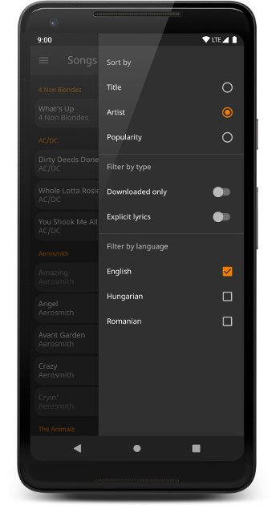
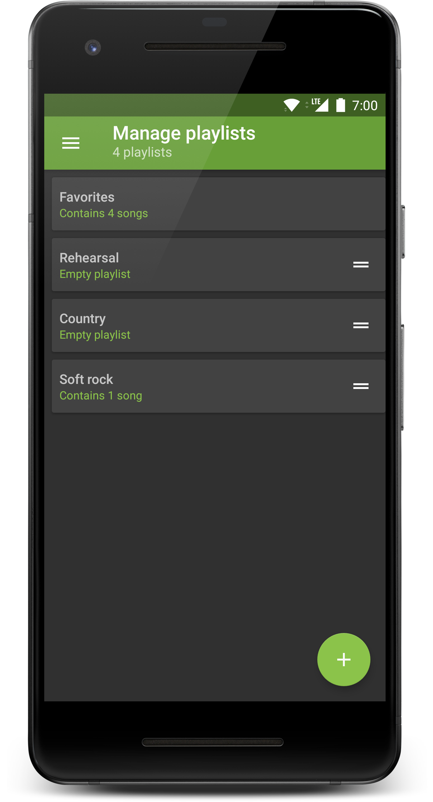

# Campfire (Client)
*Explore a handpicked library of high quality song lyrics and chords.*

Campfire is a companion app for musicians and people who like to sing. It contains a small, but growing number of songs and song collections as well as useful features such as transposing the key signature, auto-scroll or the ability to create and share your own playlists.

The app follows the latest Material design guidelines, featuring beautiful animations and supporting both light and dark themes. 

Campfire is completely free, without any ads.

### Known issues
- Fast scroller should always be visible
- Android splash screen should be improved
- Pull-to-refresh on web should only be enabled for touchscreen devices: fall back to the desktop implementation otherwise.
- Version number should be displayed in Settings
- Add Crashlytics and Analytics

### Screenshots
 
 
 
 

### License
This software is licensed under GNU GPL 3.0. Any derivative works must follow the same open-source license. 